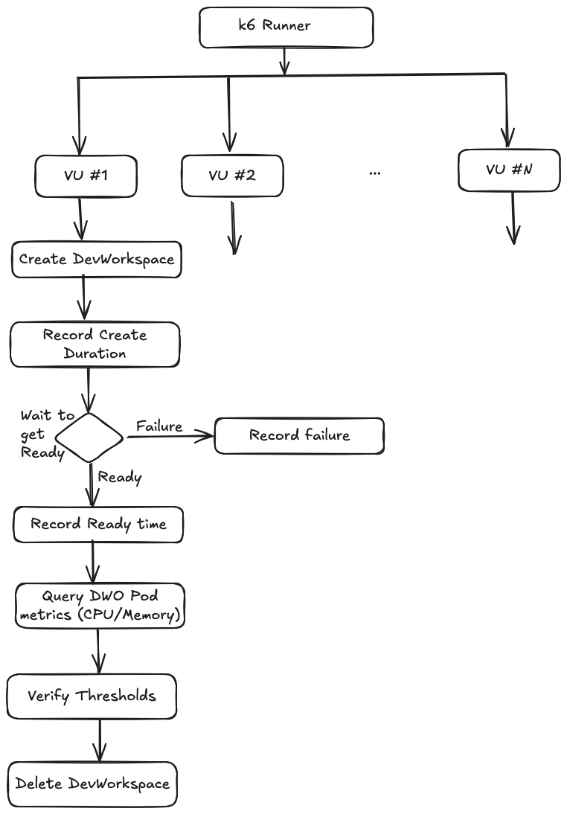
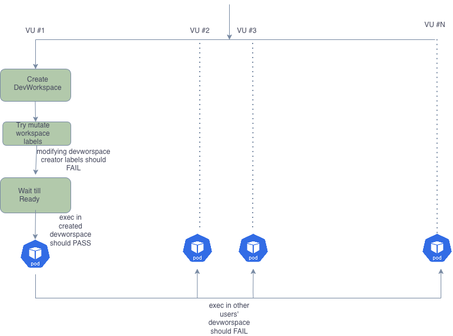

# Load Testing for DevWorkspace Operator

This directory contains load testing tools for the DevWorkspace Operator using k6. There are two test modules:

1. [**DevWorkspace Controller Load Tests**](#devworkspace-controller-load-tests) (`test-devworkspace-controller-load/`) - Tests the controller's ability to create and manage multiple DevWorkspaces concurrently
2. [**Webhook Server Load Tests**](#webhook-server-load-tests) (`test-devworkspace-webhook-server-load/`) - Tests the webhook server's admission control, identity immutability validation, and exec permission enforcement

## Prerequisites

- `kubectl` (version >= 1.24.0)
- `curl` (version >= 7.0.0)
- `k6` (version >= 1.1.0) - Required for running load tests
- Access to a Kubernetes cluster with DevWorkspace Operator installed
- Proper RBAC permissions to create DevWorkspaces, ConfigMaps, Secrets, and Namespaces
- Metrics server enabled in the cluster (required for webhook server load tests)

## DevWorkspace Controller Load Tests
The **DevWorkspace Controller Load Tests** evaluate the performance of the DevWorkspace Controller by simulating multiple concurrent DevWorkspace creations. This helps ensure that the controller can handle load effectively and maintain performance under stress.



The controller load tests can be run using the `make test_load` target with various arguments. The tests support two modes:
- **binary mode**: Runs k6 locally (default)
- **operator mode**: Runs k6 using the k6-operator in the cluster

### Running Controller Tests with Eclipse Che

When running with Eclipse Che, the script automatically provisions additional ConfigMaps for certificates that are required for Che workspaces to function properly.

```bash
make test_load ARGS=" \
  --mode binary \
  --run-with-eclipse-che true \
  --max-vus ${MAX_VUS} \
  --create-automount-resources true \
  --max-devworkspaces ${MAX_DEVWORKSPACES} \
  --devworkspace-ready-timeout-seconds 3600 \
  --delete-devworkspace-after-ready false \
  --separate-namespaces false \
  --test-duration-minutes 40"
```

**Note**: When `--run-with-eclipse-che true` is set, the script will:
- **Automatically install Eclipse Che if not already present** (requires `chectl`)
  - Detects platform: CRC, OpenShift, or Kubernetes
  - Uses appropriate chectl deployment command
  - Waits for Che to become ready
- Provision a workspace namespace compatible with Eclipse Che
- Create additional certificate ConfigMaps required by Che (750 certificates ~1MiB)

**Prerequisites for Eclipse Che tests:**
- `chectl` CLI installed (only if Che is not already installed)
  - Install: `npm install -g chectl` or `bash <(curl -sL https://che-incubator.github.io/chectl/install.sh)`
  - More info: https://github.com/che-incubator/chectl

### Running Controller Tests without Eclipse Che

When running without Eclipse Che, the standard namespace setup is used without additional certificate ConfigMaps.

```bash
make test_load ARGS=" \
  --mode binary \
  --max-vus ${MAX_VUS} \
  --create-automount-resources true \
  --max-devworkspaces ${MAX_DEVWORKSPACES} \
  --devworkspace-ready-timeout-seconds 3600 \
  --delete-devworkspace-after-ready false \
  --separate-namespaces false \
  --test-duration-minutes 40"
```

### Controller Test Parameters

| Parameter | Description | Default | Example |
|-----------|-------------|---------|---------|
| `--mode` | Execution mode: `binary` or `operator` | `binary` | `--mode binary` |
| `--max-vus` | Maximum number of virtual users (concurrent DevWorkspace creations) | `100` | `--max-vus 50` |
| `--max-devworkspaces` | Maximum number of DevWorkspaces to create (-1 for unlimited) | `-1` | `--max-devworkspaces 200` |
| `--separate-namespaces` | Create each DevWorkspace in its own namespace | `false` | `--separate-namespaces true` |
| `--delete-devworkspace-after-ready` | Delete DevWorkspace once it becomes Ready | `true` | `--delete-devworkspace-after-ready false` |
| `--devworkspace-ready-timeout-seconds` | Timeout in seconds for workspace to become ready | `1200` | `--devworkspace-ready-timeout-seconds 3600` |
| `--devworkspace-link` | URL to external DevWorkspace JSON to use instead of default | (empty) | `--devworkspace-link https://...` |
| `--create-automount-resources` | Create automount ConfigMap and Secret for testing | `false` | `--create-automount-resources true` |
| `--dwo-namespace` | DevWorkspace Operator namespace | `openshift-operators` | `--dwo-namespace devworkspace-controller` |
| `--logs-dir` | Directory for DevWorkspace and event logs | `logs` | `--logs-dir /tmp/test-logs` |
| `--test-duration-minutes` | Duration in minutes for the load test | `25` | `--test-duration-minutes 40` |
| `--run-with-eclipse-che` | Enable Eclipse Che integration (adds certificate ConfigMaps) | `false` | `--run-with-eclipse-che true` |
| `--che-cluster-name` | Eclipse Che cluster name (when using Che) | `eclipse-che` | `--che-cluster-name my-che` |
| `--che-namespace` | Eclipse Che namespace (when using Che) | `eclipse-che` | `--che-namespace my-che-ns` |

### What the Controller Tests Do

1. **Setup**: Creates a test namespace, ServiceAccount, and RBAC resources
2. **Eclipse Che Setup** (if enabled): Provisions Che-compatible namespace and certificate ConfigMaps
3. **Load Generation**: Creates DevWorkspaces concurrently based on `--max-devworkspaces`
4. **Monitoring**: 
   - Watches DevWorkspace status until Ready
   - Monitors operator CPU and memory usage
   - Tracks etcd metrics
   - Logs events and DevWorkspace state changes
5. **Cleanup**: Removes all created resources and test namespace

### Controller Test Metrics

The controller tests track the following metrics:
- DevWorkspace creation duration
- DevWorkspace ready duration
- DevWorkspace deletion duration
- Operator CPU and memory usage
- etcd CPU and memory usage
- Success/failure rates

### Controller Test Output

- **Logs**: Stored in the `logs/` directory (or custom directory specified by `--logs-dir`)
  - `{timestamp}_events.log`: Kubernetes events
  - `{timestamp}_dw_watch.log`: DevWorkspace watch logs
  - `dw_failure_report.csv`: Failed DevWorkspaces report
- **HTML Report**: Generated when running in binary mode (outside cluster)
- **Console Output**: Real-time test progress and summary

## Webhook Server Load Tests

The webhook server load tests validate the admission webhook's functionality, including identity immutability enforcement and exec permission validation. These tests create multiple DevWorkspaces with different users and verify that:



- DevWorkspace identity labels cannot be modified after creation
- Pod identity labels cannot be modified
- Exec permissions are correctly enforced (users can exec into their own workspaces but not others')
- Webhook server performance under load (latency, CPU, memory)

### Running Webhook Server Load Tests

The webhook server load tests can be run using the `make test_webhook_load` target:

```bash
make test_webhook_load
```

You can customize the test by setting environment variables:

```bash
make test_webhook_load ARGS="--number-of-users 50 --load-test-namespace dw-webhok-loadtest --webhook-server-namespace openshift-operators"
```

### Webhook Server Test Parameters

The webhook server tests use environment variables for configuration:

| Environment Variable | Description | Default |
|---------------------|-------------|---------|
| `N_USERS` | Number of concurrent users (virtual users) | `10` |
| `LOAD_TEST_NAMESPACE` | Namespace where DevWorkspaces will be created | `dw-webhook-loadtest` |
| `WEBHOOK_NAMESPACE` | Namespace where webhook server pods are running | `openshift-operators` |
| `KUBE_API` | Kubernetes API server URL (auto-detected from kubeconfig) | Auto-detected |
| `DEV_WORKSPACE_READY_TIMEOUT_IN_SECONDS` | Timeout for DevWorkspaces to become Ready | `600` |

### What the Webhook Server Tests Do

1. **Setup**: 
   - Creates a test namespace
   - Creates multiple ServiceAccounts (one per user)
   - Creates ClusterRoleBindings for each ServiceAccount
   - Generates authentication tokens for each user

2. **Phase 1 - DevWorkspace Creation**: 
   - Each user creates a DevWorkspace with restricted access annotation
   - Tracks creation latency

3. **Phase 2 - Wait for Ready**: 
   - Waits until all DevWorkspaces reach Ready/Running state
   - Validates that all workspaces become ready within the timeout

4. **Phase 3 - Identity Immutability Validation**: 
   - Attempts to modify DevWorkspace identity labels (should be denied)
   - Attempts to modify Pod identity labels (should be denied)
   - Validates that webhook correctly rejects these modifications
   - Tracks mutating webhook latency

5. **Phase 4 - Exec Permission Validation**: 
   - Each user attempts to exec into their own DevWorkspace (should succeed)
   - Each user attempts to exec into other users' DevWorkspaces (should fail)
   - Validates that exec permissions are correctly enforced
   - Tracks exec latency and permission check results

6. **Monitoring**: 
   - Collects webhook pod CPU and memory metrics
   - Tracks webhook latency for mutating operations
   - Monitors exec permission enforcement

7. **Cleanup**: Removes the test namespace and all resources

### Webhook Server Test Metrics

The webhook server tests track the following metrics:
- `exec_allow_rate`: Rate of successful exec operations on own workspaces
- `exec_deny_rate`: Rate of successful exec denials on foreign workspaces
- `exec_allowed_total`: Total count of allowed exec operations
- `exec_denied_total`: Total count of denied exec operations
- `exec_unexpected_allowed_total`: Count of exec operations that should have been denied but were allowed (security issue)
- `exec_unexpected_denied_total`: Count of exec operations that should have been allowed but were denied
- `create_latency_ms`: DevWorkspace creation latency
- `exec_latency_ms`: Exec operation latency
- `mutating_latency_ms`: Mutating webhook operation latency
- `invalid_mutating_deny_ms`: Count of invalid mutating operations that were correctly denied
- `average_webhook_cpu_millicores`: Average CPU usage of webhook server pods
- `average_webhook_memory_mb`: Average memory usage of webhook server pods

### Webhook Server Test Output

- **Console Output**: Real-time test progress and summary with metrics
- **Test Results**: Metrics are displayed in the console at the end of the test run

## Backup/Restore Load Tests

The **Backup/Restore Load Tests** validate the DevWorkspace Operator's backup feature ([CRW-9437](https://issues.redhat.com/browse/CRW-9437)) under high load conditions.


**Key Features:**
- Runs as a **post-operation hook** after normal load testing
- Creates configurable number of workspaces (50, 500, 2000+), then stops them to trigger backups
- Monitors backup Job creation, completion, and resource usage
- Tests both correct and incorrect DWOC configurations
- Each workspace in separate namespace (simulates multiple users)

### Running Backup/Restore Tests

**Quick Start (Smoke Test - 50 workspaces):**
```bash
# 1. Create registry secret
kubectl create secret docker-registry quay-push-secret \
  --docker-server=quay.io \
  --docker-username=<your-username> \
  --docker-password=<your-password> \
  -n openshift-operators

kubectl label secret quay-push-secret \
  controller.devfile.io/watch-secret=true \
  -n openshift-operators

# 2. Update test plan with your registry path
sed -i 's/quay.io\/CHANGEME/quay.io\/yourusername/g' \
  test-plans/backup-restore-smoke-test-plan.json

# 3. Run smoke test
./scripts/run_all_loadtests.sh test-plans/backup-restore-smoke-test-plan.json
```

**Medium Scale (500 workspaces):**
```bash
./scripts/run_all_loadtests.sh test-plans/backup-restore-correct-config-test-plan.json
```

**Production Scale (2000 workspaces on powerful clusters):**
```bash
# Enable 2000 workspace test in JSON, then:
./scripts/run_all_loadtests.sh test-plans/backup-restore-correct-config-test-plan.json
```

### Test Scenarios

**Case 1: Correct DWOC Configuration**
- DWOC configured correctly
- Backup Jobs should succeed
- Expected: >95% success rate, stable resource usage

**Case 2: Incorrect DWOC Configuration**
- DWOC misconfigured (typo in registry path)
- Multiple backup Jobs created and fail
- Expected: High failure rate, resource spike

### Backup Test Metrics

- Total backup Jobs created
- Jobs succeeded / failed
- Success rate / failure rate
- Average Job duration
- Backup Job pod CPU/memory usage
- Operator and etcd resource usage during backup operations

### Backup Test Output

- `<timestamp>_backup_jobs_watch.log` - Real-time backup Job events
- `<timestamp>_backup_jobs_metrics.txt` - Job metrics summary
- `<timestamp>_backup_jobs_failures.log` - Failed Job details
- `<timestamp>_backup_summary.txt` - Comprehensive report

**For detailed documentation, see:** [BACKUP_LOAD_TESTING.md](./test-devworkspace-controller-load/BACKUP_LOAD_TESTING.md)

## Troubleshooting

- **Permission errors**: Ensure your kubeconfig has sufficient RBAC permissions
- **Timeout errors**: Increase `--devworkspace-ready-timeout-seconds` (controller tests) or `DEV_WORKSPACE_READY_TIMEOUT_IN_SECONDS` (webhook tests) for slower clusters
- **Resource exhaustion**: Reduce `--max-vus` (controller tests) or `N_USERS` (webhook tests) if cluster resources are limited
- **k6 not found**: Install k6 from https://k6.io/docs/getting-started/installation/
- **Metrics not available**: Ensure metrics server is enabled in your cluster (required for webhook server tests)

## Additional Notes

### Controller Tests
- The tests use an opinionated minimal DevWorkspace by default, or you can provide a custom one via `--devworkspace-link`
- When `--separate-namespaces true` is used, each DevWorkspace gets its own namespace
- The `--delete-devworkspace-after-ready false` option is useful for testing sustained load scenarios
- Certificate ConfigMaps are only created when `--run-with-eclipse-che true` is set

### Webhook Server Tests
- Each test user gets their own ServiceAccount with a unique token
- The tests use restricted-access DevWorkspaces to validate security features
- Webhook pod metrics are collected periodically during the test
- The test namespace is automatically cleaned up after the test completes

